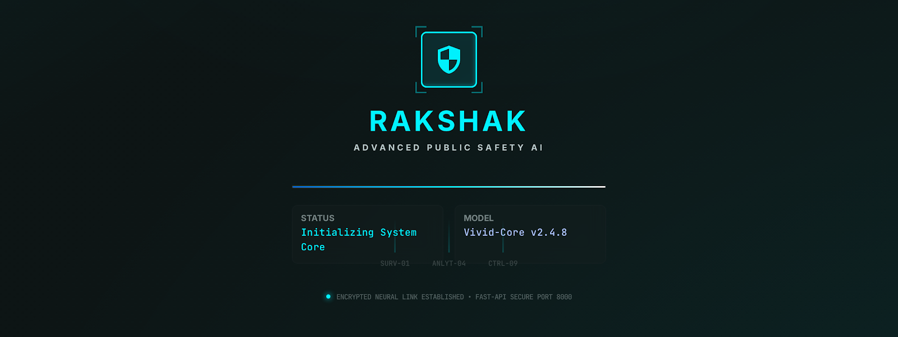
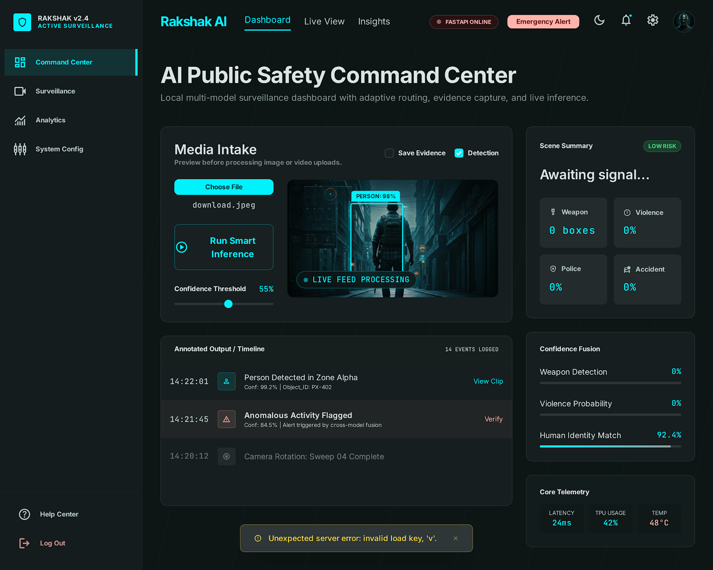
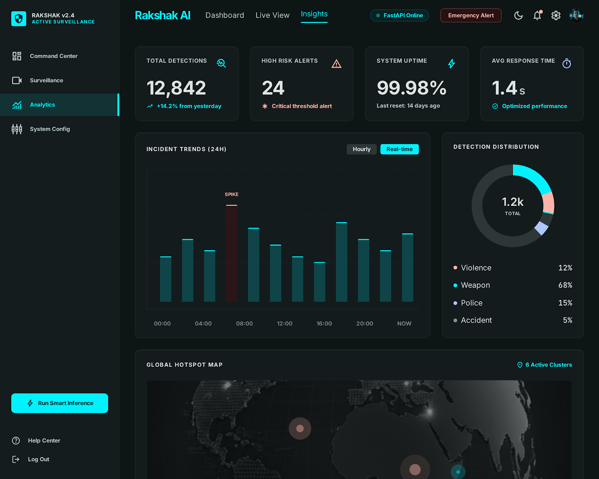

<p align="center">
  
</p>

<h1 align="center">🛡️ Rakshak – AI-Powered Public Safety Surveillance System</h1>

<p align="center">
  Intelligent Multi-Model Surveillance System for <b>Violence Detection</b>, <b>Weapon Detection</b>, <b>Police Presence Recognition</b>, and <b>Accident Monitoring</b> using Deep Learning.
</p>

<p align="center">
  
  
  
  
  
  
</p>

---

### 📌 Overview

Rakshak is a modern AI-driven surveillance platform designed for **real-time public safety monitoring**.  
The system combines multiple Deep Learning models into a unified intelligent pipeline capable of identifying:

- 🔫 Weapons
- ⚠️ Violent Activities
- 👮 Police Presence
- 🚗 Accidents
- 🧠 Final Threat-Level Scene Classification

The project includes:

✅ Real-Time Detection  
✅ Live Camera Monitoring  
✅ AI Analytics Dashboard  
✅ Evidence Logging  
✅ Multi-Model Confidence Fusion  
✅ FastAPI Backend APIs  
✅ React + Tailwind Modern Dashboard  

---

###  🖼️ Dashboard Preview

<p align="center">
  
</p>

---

### 📊 Analytics Dashboard

<p align="center">
  
</p>

---

### ✨ Core Features

| Feature | Description |
|---|---|
| 🔫 Weapon Detection | YOLOv8-based firearm and knife detection |
| ⚠️ Violence Detection | MobileNet + LSTM temporal violence recognition |
| 👮 Police Detection | MobileNetV2 feature extractor + classifier |
| 🚗 Accident Detection | ResNet50 PyTorch accident classification |
| 🧠 Smart Threat Fusion | Multi-model weighted confidence fusion |
| 📷 Live Webcam Detection | Real-time frame-by-frame monitoring |
| 🎥 Video Processing | Full video upload and inference |
| 🖼️ Image Inference | Instant image-based prediction |
| 📊 Analytics Dashboard | Visual logs, alerts, and confidence tracking |
| 📝 Detection Logging | Structured runtime and prediction logs |
| 💾 Evidence Saving | Save annotated evidence frames automatically |
| 🌐 REST APIs | FastAPI-powered backend endpoints |
| 🎨 Modern UI | Glassmorphism-based responsive React frontend |

---

### 🧠 AI Detection Architecture

```text
                ┌────────────────────┐
                │ Input Media Stream │
                │ Image / Video / RT │
                └─────────┬──────────┘
                          │
          ┌───────────────▼────────────────┐
          │ Intelligent Inference Router   │
          └───────────────┬────────────────┘
                          │
      ┌─────────────────────────────────────────┐
      │ Multi-Model Parallel Inference Engine  │
      └─────────────────────────────────────────┘
         │           │           │          │
         ▼           ▼           ▼          ▼
   YOLOv8       MobileNet     MobileNet   ResNet50
 Weapon Model   + LSTM        Police      Accident
                Violence      Detector    Detector
                          │
                          ▼
             ┌─────────────────────────┐
             │ Confidence Fusion Layer │
             └─────────────────────────┘
                          │
                          ▼
                ┌─────────────────┐
                │ Final Threat AI │
                └─────────────────┘
# 📂 Project Structure

```text
AI-Powered-Public-Safety-Surveillance-System/
│
├── backend/                          # FastAPI backend wrapper
│   ├── main.py
│   ├── routes/
│   ├── middleware/
│   └── config/
│
├── frontend/                         # React + Tailwind dashboard
│   ├── src/
│   ├── public/
│   ├── components/
│   └── pages/
│
├── models/                           # Local trained model weights
│   ├── weapon/
│   ├── violence/
│   ├── police/
│   └── accident/
│
├── notebooks/                        # Training & evaluation notebooks
│   ├── model_evaluation_dashboard.ipynb
│   └── experiments/
│
├── src/
│   └── deployment/                   # Core inference engine
│       ├── inference.py
│       ├── fusion_engine.py
│       ├── model_loader.py
│       ├── preprocessing.py
│       └── utils.py
│
├── datasets/                         # Dataset manifests & splits
│   ├── weapon/
│   ├── violence/
│   ├── police/
│   └── accident/
│
├── utils/                            # Shared utility modules
│
├── evidence/                         # Saved annotated evidence frames
│
├── logs/                             # Runtime & prediction logs
│
├── assets/                           # README images & logo assets
│   ├── logo.png
│   ├── dashboard.png
│   └── analytics.png
│
├── requirements.txt
├── README.md
└── .gitignore
```

---

### ⚙️ Smart Inference Pipeline

The deployment pipeline includes advanced runtime intelligence:

| Capability | Description |
|---|---|
| ✅ Input Validation | Secure validation for image/video/live streams |
| ⚡ Adaptive Routing | Dynamic routing based on media type |
| 🧠 Multi-Model Fusion | Combined weighted decision making |
| 📉 Confidence Filtering | Removes weak detections |
| 🛡️ Fault-Tolerant Execution | Graceful fallback if any model fails |
| 📋 Structured Logging | Prediction + latency + runtime logs |
| 🚨 Threat Prioritization | Weapon > Violence > Accident > Police |

---

### 🌐 Backend API Endpoints

| Method | Endpoint | Description |
|---|---|---|
| `GET` | `/health` | Model runtime health check |
| `POST` | `/upload` | Upload image/video |
| `POST` | `/live-detect` | Webcam frame inference |
| `GET` | `/logs` | Retrieve detection logs |
| `POST` | `/detect` | Legacy detection endpoint |
| `GET` | `/stream-demo` | Live annotated camera stream |

---

### 🚀 Local Installation

#### 1️⃣ Create Virtual Environment

```bash
python -m venv .venv
```

---

#### 2️⃣ Activate Environment

#### Windows

```bash
.venv\Scripts\activate
```

#### Linux / Mac

```bash
source .venv/bin/activate
```

---

#### 3️⃣ Install Dependencies

```bash
python -m pip install --upgrade pip
pip install -r requirements.txt
```

---

#### ▶️ Run Backend

```bash
uvicorn backend.main:app --reload --host 127.0.0.1 --port 8000
```

---

#### 💻 Run Frontend

```bash
cd frontend
npm install
npm run dev
```

Open:

```text
http://127.0.0.1:5173
```

---

### 🎛️ Dashboard Features

| UI Feature | Description |
|---|---|
| 🌙 Dark Glassmorphism UI | Modern responsive interface |
| 📷 Live Camera Monitoring | Webcam-based detection |
| 🎥 Video Upload | Real-time video inference |
| 🖼️ Image Upload | Instant image predictions |
| 🎚️ Confidence Slider | Adjustable detection thresholds |
| 📊 Analytics Panel | Visual confidence monitoring |
| 🚨 Threat Alerts | High-risk popup notifications |
| 📝 Timeline Logs | Detection history timeline |
| 💾 Save Evidence | Export annotated detections |

---

### 📈 Model Evaluation Results

#### 🖥️ Evaluation Environment

| Component | Details |
|---|---|
| Ultralytics | 8.3.160 |
| Python | 3.11.1 |
| Torch | 2.5.1+cu121 |
| GPU | NVIDIA GeForce RTX 4060 Laptop GPU |
| CUDA Device Memory | 8188 MiB |
| Model Layers | 72 |
| Parameters | 3,006,623 |
| GFLOPs | 8.1 |

---

### 📊 Overall Detection Performance

| Metric | Score |
|---|---|
| Precision | 0.821 |
| Recall | 0.814 |
| mAP@0.5 | 0.833 |
| mAP@0.5:0.95 | 0.566 |

---

### 🧪 Per-Class Evaluation Metrics

| Class | Precision | Recall | F1-Score | mAP@0.5 |
|---|---|---|---|---|
| NonViolence | 0.789 | 0.855 | 0.821 | 0.603 |
| Violence | 0.875 | 0.889 | 0.882 | 0.668 |
| Guns | 0.979 | 0.939 | 0.958 | 0.749 |
| Knife | 0.630 | 0.549 | 0.586 | 0.292 |
| Police | 0.829 | 0.837 | 0.833 | 0.514 |

---

### 📉 Validation Statistics

| Validation Property | Value |
|---|---|
| Validation Images | 995 |
| Instances | 1302 |
| Background Images | 144 |
| Corrupt Images | 0 |
| Validation Speed | 17.86 it/s |
| Fast Image Access | Enabled |

---

#### 📓 Evaluation Notebook

Open the notebook:

```text
notebooks/model_evaluation_dashboard.ipynb
```

---

#### 📄 Validation CSV Format

```csv
path,label
assets/sample_images/example.jpg,weapon
```

---

#### 📁 Expected Validation Manifests

```text
datasets/weapon/validation.csv
datasets/violence/validation.csv
datasets/police/validation.csv
datasets/accident/validation.csv
```
---

### 📊 Notebook Outputs

The evaluation notebook generates:

- ✅ Confusion Matrices
- ✅ Precision / Recall Graphs
- ✅ F1-Score Reports
- ✅ Accuracy Comparison
- ✅ Error Analysis
- ✅ Sample Predictions
- ✅ Multi-Model Comparison Charts

---

### ⚙️ Model Path Overrides

The backend loads models locally from the `models/` directory.

You can override paths using environment variables:

```bash
set WEAPON_MODEL_PATH=models/weapon/best.pt

set VIOLENCE_MODEL_PATH=models/violence/final_model.h5

set POLICE_MODEL_PATH=models/police/police_or_danger.h5

set ACCIDENT_MODEL_PATH=models/accident/accident_model.pth
```

---

### 📌 Offline MobileNetV2 Support

For fully offline MobileNetV2 police feature extraction:

```bash
set POLICE_BACKBONE_WEIGHTS=models/police/mobilenet_v2-b0353104.pth
```

---

### 🛠️ Tech Stack

| Category | Technologies |
|---|---|
| Frontend | React, TailwindCSS |
| Backend | FastAPI |
| Detection | YOLOv8 |
| Deep Learning | PyTorch, TensorFlow, Keras |
| Vision | OpenCV |
| APIs | REST |
| Deployment | Uvicorn |
| Logging | Python Logging |

---

### 🔮 Future Improvements

- 🔴 Real-Time CCTV Streaming Support
- ☁️ Cloud Deployment
- 📱 Mobile Monitoring App
- 🛰️ Multi-Camera Tracking
- 🧠 Transformer-Based Threat Detection
- 🔔 Telegram / SMS Emergency Alerts
- 🌍 Geo-Tagged Incident Mapping

---

### 👨‍💻 Contributors

| Name | Role |
|---|---|
| Team Chocos | AI Research & Development |
| Rakshak Project | Intelligent Public Safety Surveillance |

---

### 📜 License

This project is intended for:

- Academic Research
- AI Surveillance Studies
- Public Safety Innovation
- Smart Monitoring Systems

---

<p align="center">
  <b>🛡️ Rakshak — AI for Safer Public Spaces</b>
</p>
